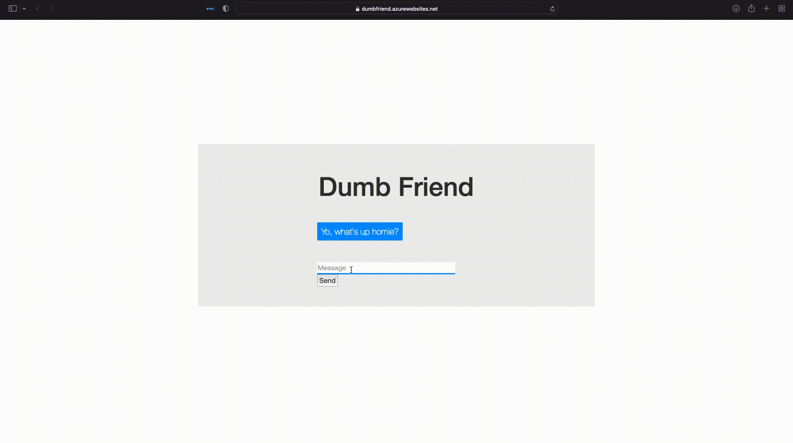

# dumb_friend
A very stupid chatbot for you to talk to.

# Here is an example of it being itself:

# To run the chatbot, do the following:
- Create a python environment (I usually use conda):
    - `conda create -n chatbot_env`
- Activate the environment:
    - `conda activate chatbot_env`
- Install the requirements (run in the same folder as requirements.txt):
    - `pip3 install -r requirements.txt`
- Run the flask app (run in the same folder as app.py):
    - `flask run`
- Click on the link that the flask app spins up (it is likely: http://127.0.0.1:5000/)